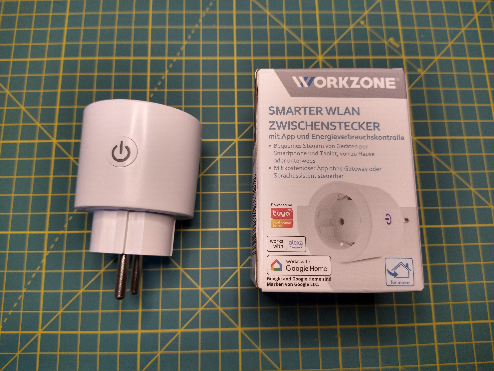
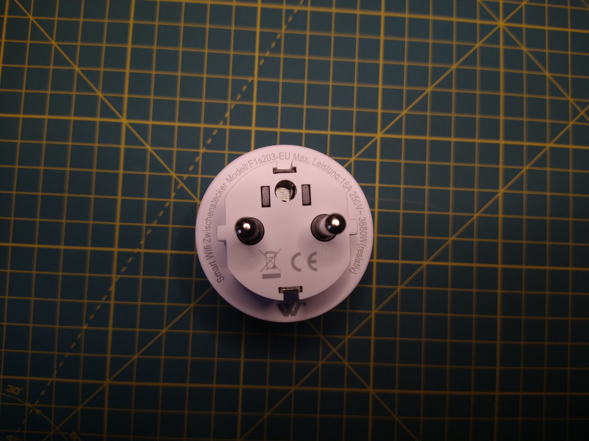
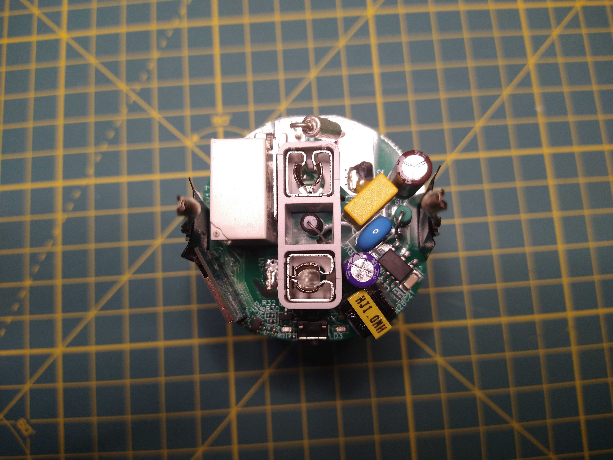
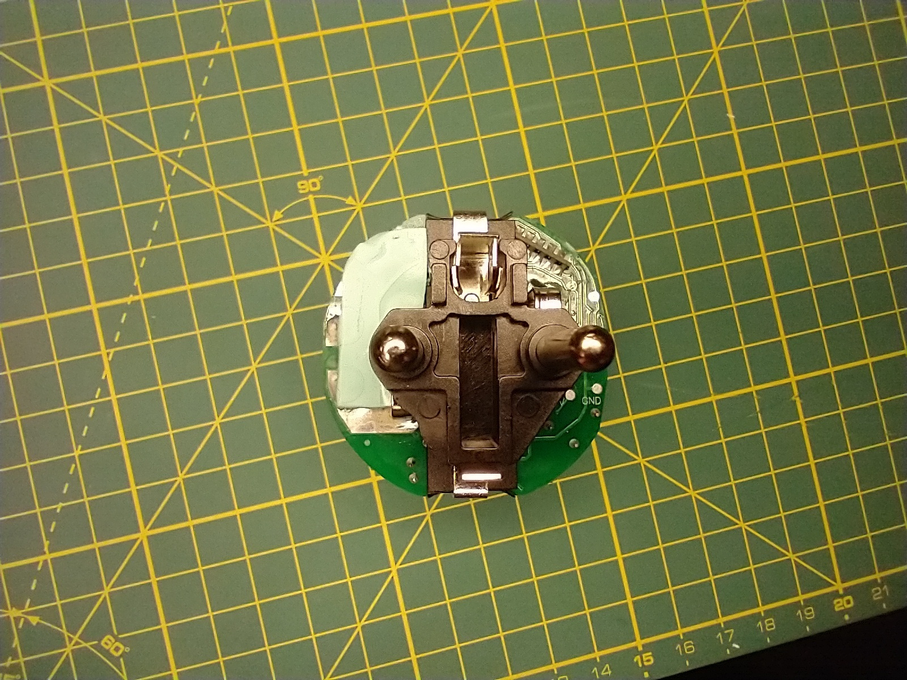
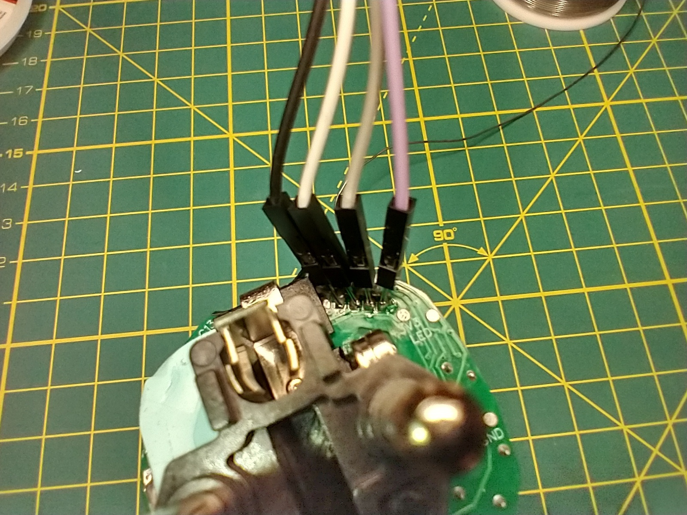
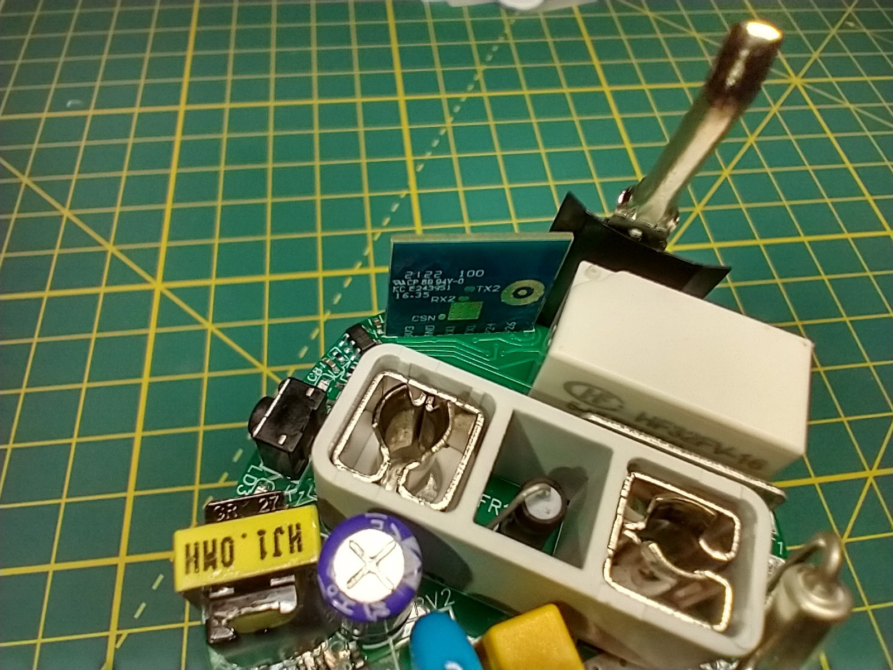
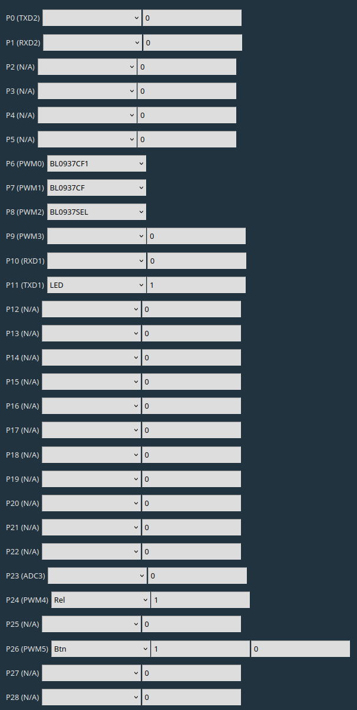
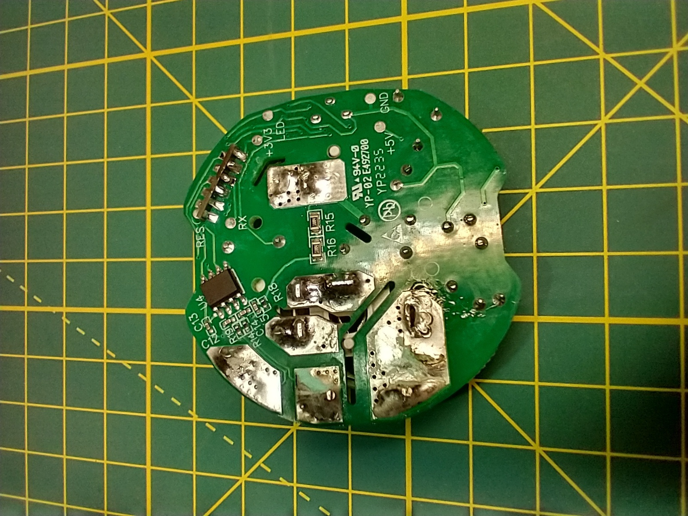

# Antela F1s203-EU OpenBK7231

This README contains information for flashing the Antela F1s203-EU WiFi smart plug with OpenBK7231 firmware.  

## The device

The Antela F1s203-EU is a WiFi controlled smart home power plug, based on Tuya CB2S and a Belling BL0937 energy meter chip. The device was sold as:

- Workzone Smarter WLAN Zwischenstecker (ALDI Nord, Germany)

### Getting UART

For flashing the device you need to open it and solder a UART console to the CB2S controller. Opening works best by inserting a small knife between the two parts on the outer edge of the plugs female side. Once the knife is in swap it with two plastic picks and move them both about one eigth around the plug. Best insertion point for the knife is just above the button as the plug is a bit thinner on this side.

Once the casing is opened you can remove the safety lock part and the buttons plastic part. Afterwards just push the electronics part out by pushing the IEC plug pins.

You can now solder a UART console to the bottom side of the board where the pins of the CB2S are exposed. The pins are labeled on the other side.

At this point you can flash as usual using [OpenBK7231T_App](https://github.com/openshwprojects/OpenBK7231T_App). For me this worked best through Windows (VM). Flashing with the App through Linux failed repeatedly.

## Configuration

The configuration needed after flashing looks as follows:

| Pin | Function | Channel |
|-----|----------| --------|
| P6 (PWM0) | BL0937CF1 ||
| P7 (PWM1) | BL0937CF ||
| P8 (PWM2) | BL0937SEL ||
| P11 (TXD1) | LED | 1 |
| P24 (PWM4) | Relay | 1 |
| P16 (PWM5) | Button | 1 |

### Analysis

Just for reference: I gathered the correct pin configuration with a multimeter testing resistance between the BL0937 and the CB2S pins. The remaining pins for the relay, button and LED were found through trial and error. The BL0937 is  hidden under the IEC plugs metal bridge. I had to remove it for analysis.

